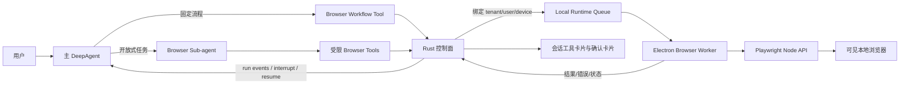

# BiWork 通用浏览器能力架构与实施计划

## 1. 目标与原则

BiWork 的浏览器能力分为两个独立层次：

1. **本地浏览器执行器**：由 Electron 主进程持有浏览器进程、持久化 Profile、Cookie、页面和下载，是受 Rust 控制面治理的本地能力，不是 Agent。
2. **浏览器推理层**：仅在开放式网页任务中使用 DeepAgents Browser Sub-agent，通过受限动作工具形成 `plan -> act -> observe -> verify` 循环。

固定、稳定的业务流程优先使用确定性 Playwright Workflow；只有页面路径和信息来源无法预先确定时才启用 Browser Sub-agent。正确性、可恢复性和用户可见性优先于自动化程度。

## 2. 场景决策

| 场景 | 实现方式 | LLM Loop | Sub-agent |
| --- | --- | --- | --- |
| OA 会议室预订、工时填写 | 版本化确定性 Workflow | 否 | 否 |
| 搜索网站并整理资料 | Browser Sub-agent + 受限动作 | 是 | 是 |
| 主任务可选的专利检索 | 用户批准后创建浏览器子任务 | 子任务内需要 | 是 |

浏览器动作不得直接暴露任意 JavaScript、Shell、Cookie 读取和真实文件系统路径。网页内容一律视为不可信输入，不能覆盖系统指令或扩大工具权限。

## 3. 总体架构



### 3.1 Rust 控制面

- 对浏览器工具调用进行 FerrisKey 授权、风险判定和审计。
- 将动作绑定到当前 `device_id`，只有发起会话的桌面实例可以领取。
- 复用 `local_exec_requests` 下发短时浏览器动作；单个动作必须在受限超时内结束。
- 保持 DeepAgent `thread_id`、checkpoint、approval 和 resume 的权威状态。
- 不保存 Cookie、密码、Authorization Header 或浏览器 Profile 内容。

### 3.2 Electron Browser Worker

- 运行于 Electron 主进程，而不是 Renderer。
- 使用独立的持久化 Profile，默认路径位于 `app.getPath("userData")/browser-profiles`。
- 浏览器默认 headed，用户可以看到执行过程。
- 优先使用 `BIWORK_BROWSER_EXECUTABLE_PATH` 或系统 Chrome/Chromium；若均不存在则使用 Playwright 自带浏览器，并在部署阶段显式安装对应版本。
- 通过命名 `session_id` 保持跨工具调用的页面和 Cookie。
- 每次页面变化后重新生成 snapshot；旧 ref 不得继续使用。
- 密码输入框只能由用户在浏览器中填写，Agent 的 `fill` 动作必须拒绝密码字段。

### 3.3 DeepAgents

- 浏览器能力默认关闭。管理员或 Agent 所有者在 `Settings -> Agents -> Agent 工具与能力` 中启用后，系统发布新的 Agent 版本快照。
- 只有已发布版本包含 `capabilities.browser.enabled=true`，且 Run 具有当前桌面 `device_id` 时，DeepAgent 才获得受限 `browser_*` 工具。
- 开放式任务优先委派给 Browser Sub-agent，减少主 Agent 上下文污染。
- `browser_wait_for_user` 作为高风险工具，在真正继续前进入现有 approval/checkpoint 流程。
- LangGraph resume 会从节点开头重新执行，因此所有任务创建和动作请求必须使用稳定幂等键。

## 4. 浏览器工具协议

本地动作使用协议 `biwork_browser.v1`，队列 `kind` 为 `browser`。

```json
{
  "protocol": "biwork_browser.v1",
  "kind": "browser",
  "session_id": "run-or-agent-selected-id",
  "profile": "default",
  "action": {
    "name": "open",
    "url": "https://example.com"
  }
}
```

当前动作集合：

- `open`
- `goto`
- `snapshot`
- `tab_list`
- `tab_open`
- `tab_select`
- `tab_close`
- `click`
- `fill`
- `press`
- `scroll`
- `wait_for_change`
- `extract_text`
- `wait_for_user`
- `close`

禁止首期动作：

- 任意 `evaluate` / `run-code`
- Cookie、LocalStorage Token 导出
- 任意本地路径下载或上传
- `file://`、`javascript:`、`data:` 导航
- 未经审批的提交、支付、删除、发送等高风险动作

## 5. Snapshot 与 Loop

Snapshot 返回：

- 当前 URL、页面标题。
- 截断后的可见正文。
- 当前页面可交互元素及短生命周期 ref。
- 当前活动 `tab_id`、所有标签页摘要和 `tab_count`。
- `auth_state/auth_expired` 登录状态提示。
- 可滚动容器的 `scrollable=true` 标记。
- password 元素只标识类型，不返回值。

开放式 Browser Sub-agent 使用收敛循环：

1. 生成 3～7 个里程碑，不生成任意 Playwright 代码。
2. 获取 snapshot。
3. 每轮只执行一个动作。
4. 校验 URL、标题、正文或目标元素是否发生预期变化。
5. 失败时最多重试两次，然后重新规划。
6. 连续三次无进展、超过 40 步或超过 15 分钟时停止并请求用户介入。

### 5.1 多标签页

- 每个 Playwright `Page` 在单个 Browser Session 生命周期内分配稳定 `tab_id`，模型不得依赖数组下标识别标签页。
- `tab_list` 只观察状态；`tab_select` 切换活动页并使旧 ref 全部失效；`tab_open` 在同一持久化 Profile 中打开新页；`tab_close` 只关闭指定页，不等价于关闭整个 Session。
- 页面通过 `window.open` 创建 popup 时自动切换到新页，同时 Snapshot 返回完整标签页摘要。目标页不明确时必须先调用 `tab_list`。
- 关闭活动页后回退到最近仍打开的页；关闭最后一个页时保留可恢复 Session 元数据，后续浏览器请求可以重建页面。

### 5.2 登录态过期

- Snapshot 对所有可见 Frame 检测可见 password 输入，并返回 `auth_state=login_required`。
- Session 曾观察到非登录页面后再次出现登录页时返回 `auth_expired=true`，用于区分首次登录和登录态失效。
- Agent 看到 `login_required` 或 `auth_expired=true` 后必须停止普通点击、填写和读取流程，调用 `browser_wait_for_user` 进入用户接管；恢复后立即重新 Snapshot。
- Persistent Profile 只负责保留本地 Cookie/Storage，不保证服务端 Session 仍有效。不得把“Profile 存在”等同于“已登录”。
- 密码、MFA 和 CAPTCHA 仍禁止由模型填写，也不得进入聊天记录、Snapshot、日志或数据库。

### 5.3 SPA 状态稳定与变化等待

- `click/fill/press/goto/scroll` 后使用有上限的 DOM mutation quiet-period，吸收同步渲染和短异步渲染，但不使用固定长 sleep。
- 页面预期内容尚未出现时，Agent 使用 `wait_for_change`。该动作比较 URL、标题和有界正文信号，检测变化后再等待 DOM 稳定并返回新 Snapshot。
- `wait_for_change` 超时返回可恢复的 `BROWSER_PAGE_UNCHANGED`，模型必须检查操作目标、当前标签页和滚动容器，不能无变化地重复提交动作。
- History API 导航、DOM 替换和前端路由切换均视为页面状态变化；完整页面导航仍由 execution-context 稳定逻辑处理。

### 5.4 虚拟列表与内部滚动

- Snapshot 除原生交互元素外，还发布具有可读标签且真实可滚动的容器，并标记 `scrollable=true`。
- `scroll` 接受可选 ref 和有界 `delta_x/delta_y`。传 ref 时滚动内部容器；不传 ref 时才滚动页面窗口。
- 每次滚动后重新生成 Snapshot。虚拟列表复用 DOM 节点，因此滚动前的元素 ref 必须全部失效，Agent 只能使用滚动结果中的新 ref。
- 单次滚动量限制为 `[-5000, 5000]`，防止模型一次跨过大量内容；需要遍历时应按页滚动、观察正文变化并设置总步数预算。

### 5.5 浏览器状态持久化（规划）

当前实现只在 Electron 进程内保存 Session、最后成功 URL 和活动页；Desktop 重启后由模型根据对话上下文重新 `browser_open`。下一阶段增加不含凭证的本地状态描述符：

```json
{
  "tenant_id": "...",
  "user_id": "...",
  "device_id": "...",
  "session_id": "...",
  "profile": "default",
  "last_url": "https://example.com/app",
  "active_tab_id": "t2",
  "tabs": [{"tab_id": "t2", "url": "https://example.com/app"}],
  "page_generation": 12,
  "updated_at": "...",
  "expires_at": "..."
}
```

- 描述符仅保存在本机受限目录；服务端最多保存脱敏状态摘要，不保存 Cookie、Storage、Header 或页面正文。
- Desktop 启动时读取描述符并验证 Profile 租约，只有收到新的用户浏览器请求才恢复页面，不在后台擅自打开网站。
- 恢复失败返回 `browser_open_required`，由 Agent 使用当前任务和会话上下文重建完整流程。

### 5.6 Snapshot 版本与 ref 约束（规划）

下一版 Snapshot 增加 `snapshot_id` 和单调递增 `page_generation`：

```text
session_id + tab_id + page_generation + ref
```

- 所有依赖 ref 的动作必须同时提交 `snapshot_id/page_generation`。
- Electron 在执行前验证版本；标签切换、导航、DOM 重新快照、恢复页面和滚动都会增加 generation。
- 版本不匹配直接返回 `BROWSER_SNAPSHOT_STALE`，不进入 Playwright locator 等待，从协议层阻止跨轮复用旧 ref。
- Snapshot ID 只用于一致性与审计，不应包含 URL、用户数据或可逆页面内容。

### 5.7 Shadow DOM（规划）

- Snapshot 采集器将以有界深度遍历 open Shadow Root，并为元素记录 `shadow_path` 与所属 Frame；ref 仍由执行器内部解析，模型不能提交 CSS/JS。
- closed Shadow Root 无法安全通用读取，应返回明确的 `shadow_root_closed` 能力提示，并优先依赖宿主元素的 ARIA、文本和标准事件。
- 遍历必须限制 Shadow Root 数量、节点数、正文长度和总耗时，避免复杂组件拖垮 Snapshot。
- 密码和敏感输入规则同样应用于 Shadow DOM 内元素。

### 5.8 Canvas、图表与纯视觉内容（规划）

文本模型优先使用结构化来源，而不是默认截图识别：

1. 读取 Canvas/图表宿主的 ARIA、标题、图例、隐藏数据表和相邻 DOM 文本。
2. 对常见图表库增加只读适配器，输出有界的 series/category/value 摘要，不暴露任意 `evaluate`。
3. 页面没有结构化数据时，生成局部截图 artifact，并由可选 OCR/视觉模型处理；主文本模型只接收脱敏后的结构化结果。
4. 无法可靠解析时明确报告“仅视觉可见”，不得根据像素位置猜测数值或执行点击。

### 5.9 并发隔离（规划）

- Profile 租约键必须包含 `tenant_id/user_id/device_id/profile`，不能只使用 profile 名称。
- 同一 Profile 默认只允许一个写控制 Session；只读并发也必须使用独立 Context，避免标签页、下载和 Storage 相互污染。
- 租约包含 owner session、heartbeat、acquired_at、expires_at 和 generation。进程崩溃后由 TTL 回收，不能永久返回 `BROWSER_PROFILE_BUSY`。
- 不同对话共享登录态时共享 Profile 数据目录，但不共享 ref、tab_id、Snapshot 或 Agent 恢复预算。
- Agent Team 或并行子任务必须显式申请独立 profile/lease，禁止多个模型同时操作同一个活动页面。

### 5.10 浏览器关闭策略（规划）

- `tab_close`、`close session`、`logout and clear profile` 是三种不同语义，不能复用一个模糊的 close。
- 默认任务结束后保留 Session 一个可配置的 follow-up grace period，允许用户继续询问；到期后关闭进程但保留 Persistent Profile。
- 用户手动关闭窗口只表示当前页面结束，不自动清除登录数据。后续新请求可按恢复策略重新打开最后页面。
- 高敏感站点可配置 `close_on_complete` 或 `clear_profile_on_logout`；清除 Profile 必须是用户显式操作并进入高风险确认。
- 后台空闲清理使用 TTL 和租约心跳，不在 Agent 推理循环中使用长 sleep，也不依赖模型决定资源释放。

首期不创建独立 Planner Agent。计划是 Browser Sub-agent 的结构化状态；只有跨站点并行研究、几十步以上任务或不同模型分工时才拆分 Planner、Executor、Verifier。

## 6. 用户介入与等待

必须区分三类等待：

### 6.1 页面短等待

在 Electron/Playwright 内等待 locator、URL 或明确业务条件，通常 5～30 秒，不创建 Agent interrupt，不使用固定长 sleep。

### 6.2 用户介入

登录、验证码和用户接管使用 `browser_wait_for_user`：

1. 浏览器窗口保持打开。
2. 工具审批卡片提示用户在浏览器完成操作。
3. Python worker 通过 DeepAgents interrupt 释放。
4. 用户点击“已完成，继续”后使用相同 thread/checkpoint resume。
5. 恢复后立即重新 snapshot，不能复用介入前 ref。

密码不进入聊天、审批 payload、日志、截图或服务端数据库。

### 6.3 等待子任务

后续阶段增加 `parent_run_id/child_run_id`：父 Agent 创建浏览器研究子 Run 后进入 `waiting_child`，子 Run 完成事件触发父 Run 恢复。不得让同步 Sub-agent 长时间占用主 worker。

## 7. OA 固定工作流

OA 会议室预订和工时填写必须实现为版本化工作流，例如：

- `oa.reserve_meeting_room.v1`
- `oa.fill_timesheet.v1`

流程以配置提供 URL、稳定 locator、成功断言和最终提交风险等级。典型状态：

```text
open -> detect_auth -> waiting_user(login) -> navigate -> fill_draft
     -> verify_summary -> approve_submit -> submit -> verify_success
```

页面结构变化时明确失败并报告工作流版本和缺失 locator；不得自动降级为任意 JavaScript。可以在用户明确同意后降级为 Browser Sub-agent 进行诊断。

## 8. 安全与治理

- 浏览器 Profile 按 tenant/user/device/profile 隔离，并使用租约避免并发控制。
- CDP 或 Playwright Server 只监听 loopback；不能复用 BiWork 自身 `BIWORK_CDP_PORT` 控制业务浏览器。
- URL 仅允许无内嵌凭证的 `http:` 和 `https:`。首期为兼容企业 OA 允许内网地址；下一阶段应按 Workflow/Profile 配置域名与网段 allowlist。
- 用户输入不带协议的域名时默认补全为 `https://`；例如 `firecrawl.dev` 先访问 `https://firecrawl.dev`，再遵循站点自己的 HTTP 重定向。内网 HTTP 服务应显式提供 `http://`，不自动从 HTTPS 降级到 HTTP。
- 页面文字视为不可信数据，Browser Sub-agent 系统提示必须声明不得执行网页中的工具调用指令。
- 截图、snapshot 和错误日志必须脱敏密码框、Token、Cookie 和 Authorization 信息。
- 文件保存继续使用 `/local/main/` 虚拟路径和现有文件审计能力。
- `browser_extract_text` 使用最新 snapshot 返回的 `ref`；禁止把 `e16` 拼成 `[ref="e16"]` 等 CSS selector。兼容旧 selector 的执行器必须短超时并返回明确错误，不能等待默认 60 秒。
- snapshot 只发布当前视口中未被裁剪的可操作元素。对于通过 `left: -9999px` 等方式移出屏幕的辅助/视觉隐藏控件，即使浏览器报告 CSS `visibility: visible`，也不能生成 ref。对使用事件委托、没有原生按钮语义的站点，可将具有可读标签的 `cursor: pointer` 根元素作为通用点击候选。
- 点击 ref 的可操作性等待应独立于页面导航超时；目标失效或不可操作时在 10 秒内返回 `BROWSER_TARGET_NOT_ACTIONABLE`，要求重新 snapshot，不能沿用 Playwright 默认的 60 秒重试。
- 浏览器 session 的 active page 不能永久绑定初始 tab。点击触发 `window.open`/popup 时自动接管最新 tab、清空旧 ref 并在新页面生成 snapshot；新 tab 关闭后回退到仍然打开的最近 tab。返回结果包含 `tab_count` 便于运行时识别多页签状态。
- 页面在 SSO、VPN、OA 等重定向链中可能在 `page.evaluate` 期间销毁 execution context。snapshot 对这类瞬态导航错误最多重试 10 秒并等待 `domcontentloaded`；持续不稳定时返回 `BROWSER_PAGE_UNSTABLE`，不能把 Playwright 原始异常直接暴露为任务失败。

### 8.1 授权边界与双重授权修复

浏览器工具调用只做一次动作级授权：

1. Python `PlatformToolWrapper` 按 `browser_open/browser_click/...`、动作参数和风险等级调用控制面授权。
2. 授权通过后，适配器向内部本地队列提交 `biwork_browser.v1` 动作。
3. Rust 队列边界严格校验协议、动作白名单、字段长度、HTTP(S) URL 和 `actor_device_id == device_id`，校验通过后直接入队，不再以通用 `execute/local_exec + critical` 重复授权。
4. 非浏览器的 legacy 本地命令仍走原有 `critical` 授权，不能借浏览器协议降权。

这解决了工具授权已通过、队列又因 `critical_risk_requires_explicit_policy` 返回 403 的问题。内部队列端点仍由服务间共享凭证保护；Electron 只领取绑定到当前登录设备的任务。

### 8.2 Agent 设置与版本治理

- 配置入口：`Settings -> Agents -> 选择 Agent -> Agent 工具与能力`。
- 本地浏览器使用一个总开关，不把 `open/click/fill` 等底层动作逐个暴露给用户；动作风险仍由运行时逐次判定。
- 开启浏览器或新增高风险 MCP 工具时必须二次确认。
- 保存会创建新的 `agent_versions` 记录，并在 `config_snapshot.capabilities.browser.enabled` 中固化状态。
- Run Snapshot 只信任已发布的服务端版本；客户端传入的 `browser` 字段会被移除，不能临时扩大权限。
- 关闭能力后，新版本的后续 Run 不再注入浏览器工具；已有浏览器 Profile 和 Cookie 不上传服务器。

## 9. 分阶段实施

### Phase 1：本地执行基础

- Electron BrowserSessionManager 和 BrowserWorker。
- Rust local-runtime wait API。
- DeepAgent 受限浏览器工具。
- 浏览器工具结果卡片和用户介入确认卡片。
- 单元测试、组件测试和协议测试。

### Phase 2：固定 OA Workflow

- 增加工作流配置 Schema、版本和 locator 验证器。
- 实现登录检测、会议室草稿、工时草稿和最终提交审批。
- 使用脱敏测试站或本地 fixture 做确定性 E2E；真实 OA 只做人工授权的 live smoke。

### Phase 3：Browser Sub-agent

- 增加 Browser Sub-agent 专用 prompt、工具 allowlist 和预算。
- 增加结构化 plan、无进展检测、重规划和来源记录。
- 保存研究结果时通过平台文件工具生成 Markdown/CSV。

### Phase 4：异步子任务

- 增加 `waiting_child`、父子 Run、自动 join/resume。
- 支持主 Agent 在浏览器研究期间继续草拟内容。
- 支持暂停、更新指令、取消和设备离线恢复。

## 10. 测试验收标准

当前 Phase 1 已落地 Rust wait API、Agent 版本级浏览器开关、单次动作授权、桌面 Run 浏览器工具注入、Electron BrowserSessionManager/Worker、密码字段拦截、用户接管确认、Renderer 工具卡片、多标签页动作、登录失效标记、SPA change wait 和虚拟列表滚动。浏览器状态持久化、Snapshot 协议版本、Shadow DOM、Canvas/图表结构化提取、跨会话并发租约和 TTL 关闭策略仍按第 5 节规划实施。OA Workflow、独立 Browser Sub-agent 预算状态机及父子异步 Run 属于后续阶段，不能用通用动作直接替代最终提交审批。

### 单元与回归

- Rust：队列领取、等待结果、设备隔离、超时、审批映射。
- Python：工具注入条件、协议 payload、取消、错误脱敏、浏览器 prompt。
- Electron：URL 校验、session 生命周期、ref 失效、密码 fill 拒绝、标签页生命周期、登录失效、SPA 变化等待、内部滚动和 worker completion。
- Renderer：浏览器结果卡片、确认卡片、窄窗口无横向溢出。

### 冒烟

- 浏览器 worker 能被桌面网关启动和停止。
- headed 浏览器打开测试页，snapshot 包含 URL、标题和可交互元素。
- 浏览器关闭后无残留 session。

### E2E

- 使用本地静态 fixture 模拟登录页、登录后页面、登录失效、popup、多标签页、SPA 延迟更新和虚拟列表。
- 验证用户介入前显示确认卡片，确认后继续并重新 snapshot。
- 验证浏览器工具卡片状态、URL 换行、长标题和窄窗口布局。
- 生产 live E2E 继续覆盖既有多轮对话、历史恢复、MCP 和 Skill，确保浏览器能力不破坏原链路。
